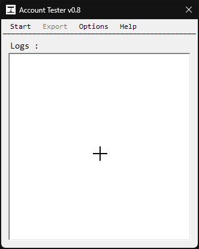

# AccountTester 

    
p>
  
## Description
AccountTester est une application Windows Forms (C#) permettant de tester divers aspects des comptes utilisateurs sur un système. Elle permet d'effectuer des vérifications sur la connectivité Internet, les droits d'accès aux lecteurs réseaux, la présence et les permissions d'Office, ainsi que la disponibilité des imprimantes. Une exportation de rapport détaillé est désormais possible.

## Features
- **Test de connexion Internet** : Vérifie si l'ordinateur a accès à Internet en envoyant une requête à Google.
- **Test des droits sur les lecteurs réseau** : Tente de créer et de supprimer un fichier test sur chaque lecteur réseau pour vérifier les permissions d'écriture.
- **Détection de la version d'Office** : Recherche la présence d'Office sur le système via la base de registre.
- **Test des droits de lecture et écriture Office** : Crée, modifie et lit un document Word pour vérifier les permissions de l'utilisateur.
- **Liste des imprimantes installées** : Affiche toutes les imprimantes disponibles sur le système.
- **Rapport détaillé des tests** : Exportation du rapport complet des test sous formats `.txt` ou résumé sous format `.log`. 

### Features in development
| Nom | Desc. |
|---|---|
| **Format d'export de rapport** | Ajout d'un export des résultats sous format `.csv`, `.json` et `.xml` | 
| **Interface améliorée** | Amélioration de l'UI pour une meilleure lisibilité des résultats. |
| **...** | ... |

## Prerequisites
Avant d'exécuter le projet, assurez-vous d'avoir les éléments suivants installés :

- Windows avec .NET Framework installé.
- Microsoft Office installé (pour les tests relatifs à Word).
- Droits d'accès suffisants pour tester les lecteurs réseaux et la base de registre. 

## Usage
1. Ouvrir l'application.
2. Cliquer sur le bouton **Start**.
3. Attendre la fin des tests.
4. Consulter les résultats dans la zone de logs.
5. Exportez les résultats si souhaité.
6. Choisissez le nom, si rien n'est entré, un nom par défaut lui sera attribué.
7. Choisissez l'emplacement de sauvegarde.
8. Selectionnez un format d'export.

## Contributing
Les contributions sont les bienvenues ! Pour contribuer à ce projet, veuillez suivre ces étapes :

1. Forkez le dépôt.
2. Créez une nouvelle branche pour votre fonctionnalité (`git checkout -b my-new-feature`).
3. Apportez vos modifications.
4. Commitez vos changements (`git commit -m 'Add my new feature'`).
5. Poussez votre branche (`git push origin my-new-feature`).
6. Ouvrez une Pull Request.

## Issues and Suggestions
Si vous rencontrez des problèmes ou avez des suggestions pour améliorer le projet, veuillez utiliser le [GitHub issue tracker](https://github.com/Miiraak/Account-Tester/issues).

## License
Ce projet n'est pas licencé.

## Authors
- [**Miiraak**](https://github.com/miiraak) - *Lead Developer*